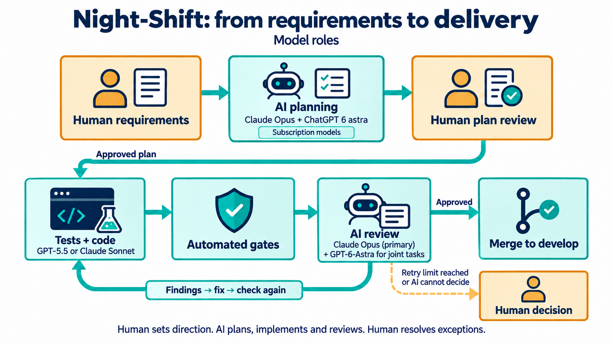
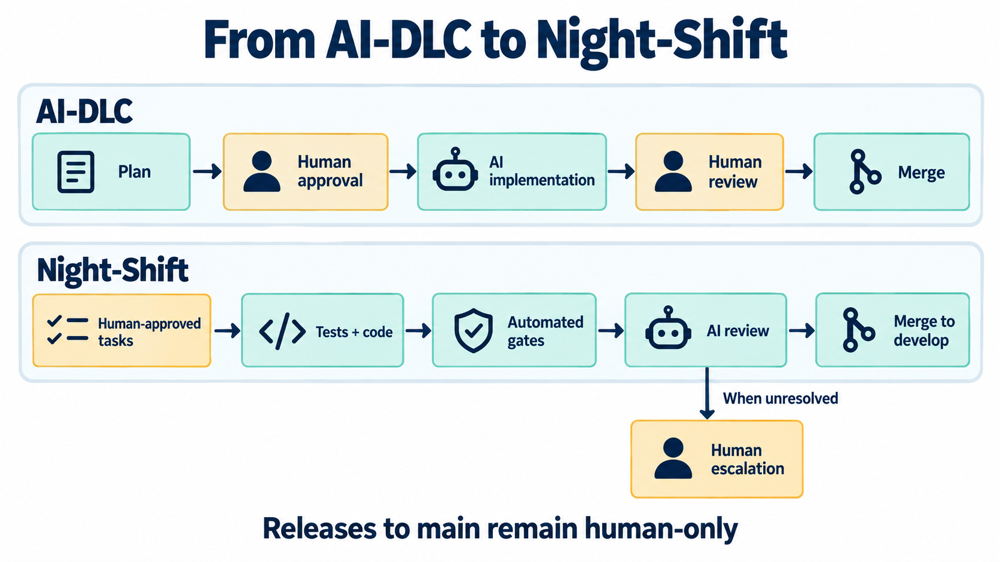
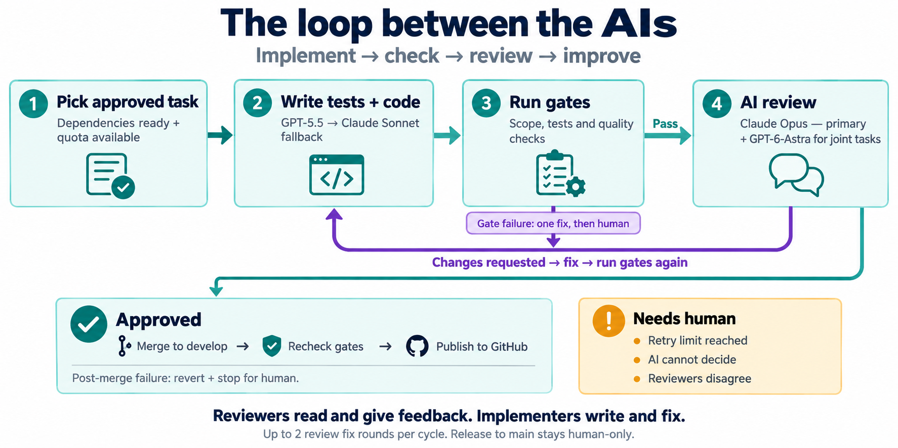
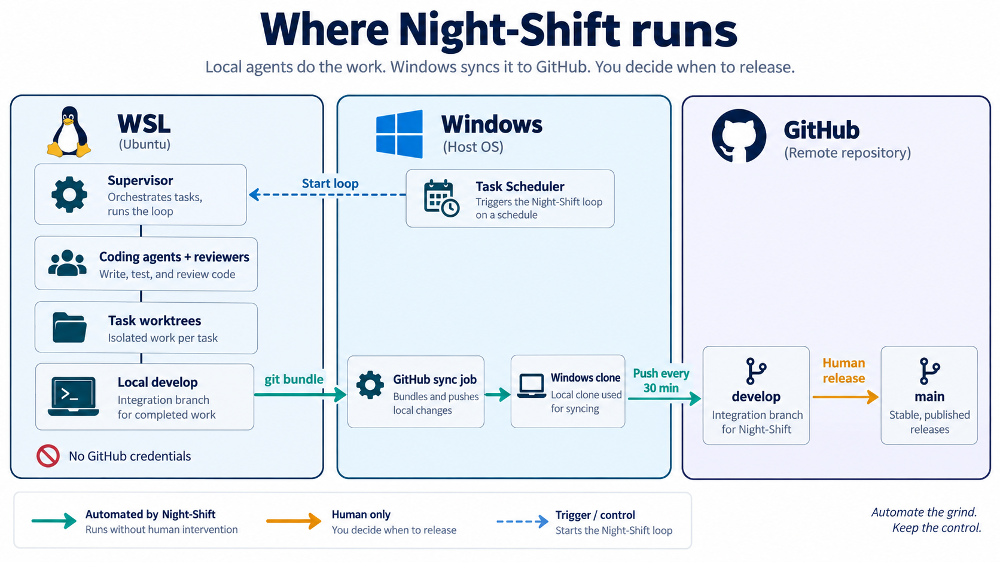

# Night-Shift

Unattended agentic software development with deterministic gates, independent review, and human escalation.

Night-Shift runs around the clock on the maintainer's machine. It works through a queue of planned tasks: AI coding
agents write the code tests-first, deterministic gates check it, an independent AI reviewer approves it, and approved
work merges into `develop` and is published to GitHub. A human is called only when the AIs cannot decide. When every
agent a task needs is out of quota, it waits for the earliest reset and continues.

| Related repository | Role |
|---|---|
| [mekhal/PrivaSheet](https://github.com/mekhal/PrivaSheet) | The project Night-Shift was built for and proven on: 37 tasks merged unattended (2026-09-17 → 09-21). Its `develop` history shows every merge with `Implemented-by` and `Reviewed-by` trailers. |
| [mekhal/aidlc-radio-calico](https://github.com/mekhal/aidlc-radio-calico) | The AI-Driven Development Life Cycle (AI-DLC) that Night-Shift automates: a 7-step loop in which a human decides at every gate. |

This README still describes the PrivaSheet installation (distro `privasheet-dev`, PrivaSheet paths and gates). The
section [Note: future template](#note-future-template) lists what to change to use it on another project.



*Figure 1. The human provides requirements and reviews the AI-generated plan. Implementation agents write tests
and code, then the planning/review models return for an independent review. Findings trigger another fix-and-review
cycle; reaching the retry limit or an issue the AI cannot decide sends the decision back to the human.*

The division of work uses the maintainer's subscription models as follows. Claude Opus is the primary reviewer
for every task; GPT-6-Astra adds a second review for `joint` tasks. These model roles were configured on 2026-09-23.
Planning and human approval happen before tasks enter the unattended queue.

1. **Human supplies requirements.** Define the desired behavior, constraints and acceptance criteria.
2. **AI prepares the plan.** Claude Opus + ChatGPT 6 astra turn those requirements into implementation tasks,
   a test strategy and acceptance criteria for the human to review.
3. **Human reviews and approves the plan.** Request changes where needed, then approve the task file before
   autonomous implementation starts. Planning happens with the maintainer, outside the unattended execution loop.
4. **AI writes tests and code.** ChatGPT 5 or Claude Sonnet implements the approved tasks tests-first.
   Deterministic gates check the result before AI review.
5. **The planning/review models return to review.** Claude Opus is the primary reviewer for every task.
   ChatGPT 6 astra (`gpt-6-astra`) adds an independent review for `joint` tasks; both must approve. Reviewers inspect
   the implementation and tests against the approved requirements in a separate, read-only role. They send findings
   and correction instructions to the implementer; they do not modify or approve their own implementation.
6. **AI loops on fixable findings.** The implementer fixes the work, the gates run again, and the reviewer checks
   the revised result. Approved work proceeds to merge into `develop`.
7. **Human decides unresolved cases.** If the configured retry limit is reached, reviewers disagree, or the AI
   cannot decide, the loop escalates with the reason and available options. The human decides whether to revise
   the task and retry or skip it. Releases from `develop` to `main` remain human-only.

## Relation to AI-DLC

The night shift is the unattended form of the **AI-Driven Development Life Cycle (AI-DLC)**:

- [mekhal/aidlc-radio-calico](https://github.com/mekhal/aidlc-radio-calico): the original AI-DLC demo. It uses a
  7-step loop driven through GitHub issues and `@claude`, and a human decides at every gate.
- [`AI-Template/ai-dlc/`](https://github.com/mekhal/PrivaSheet/tree/develop/AI-Template/ai-dlc) in the PrivaSheet repository: the same process
  extracted as a reusable template.

Night-Shift keeps the loop but makes review **exception-based**: AI reviewers take the per-step human gates, and a
human is called only when the AIs cannot decide. The work comes from a task file, not from issues, and runs on the
maintainer's machine, not on GitHub runners.



*Figure 2. Night-Shift automates routine implementation and review while people supply requirements, review the
AI-generated plan, resolve escalations and control releases to main. The compact "Human-approved tasks" box
includes the requirements, AI planning and human approval stages expanded in Figure 1. Review findings loop back
to implementation; repeated failures or decisions the AI cannot make return to the human.*

| AI-DLC step (radio-calico) | Actor there | In the night shift |
|---|---|---|
| 1 Open an issue | Human | Planning session: the maintainer and Claude write tasks into the task file. |
| 2 Plan + acceptance criteria | AI | Written in the same session. Each task carries its `body` (acceptance criteria), `paths`, `tier`, `review` and `depends_on`. |
| 3 Approve the plan and the tests wanted | Human | **Human**: committing the task file is the approval. Only the maintainer writes it. |
| 4 Failing tests → Test PR | AI | Implementer writes the tests first, in the same worktree. The `new-tests` and `tests-weakened` gates enforce it. |
| 5 Approve the Test PR | Human | AI: the reviewer checks the tests against the acceptance criteria. No separate Test PR. |
| 6 Code → Code PR | AI | Implementer writes the code, then deterministic gates run. |
| 7 Review and merge into `develop` | Human | AI: Claude Opus is the primary reviewer (plus Codex GPT-6-Astra for `joint`). An approved `green` task merges automatically. The human reviews only escalations. |
| (release) `develop` → `main` | Human | **Human** only. The night shift never touches `main`. |

### The loop between the AIs



*The implementer writes and fixes; Claude Opus is the primary reviewer, with GPT-6-Astra added for joint tasks.
Teal shows the path toward approval, purple shows the fix loop, and amber marks decisions that need a human.*

- **Start with approved work.** The supervisor picks an eligible task once its dependencies are merged and the
  required agents have quota. GPT-5.5 implements it tests-first, with Claude Sonnet as fallback.
- **Check, review, then fix.** Deterministic gates run before the read-only AI review. Findings return to the
  implementer, and every fix passes through the gates again. Reviewers give feedback; they do not edit the code.
- **Keep retries bounded.** A gate failure gets one fix; another failure escalates. Each review fix gets its own
  gate retry. Review can request up to two fix rounds per cycle. Ordinary failed attempts are capped at three;
  an explicit escalation or reviewer disagreement goes straight to the human.
- **Approve and continue.** Approved work merges into local `develop`, where gates run again. A post-merge failure
  reverts the merge and opens the circuit breaker for human intervention. On success, the supervisor can pick the
  next task; a separate sync job publishes `develop` to GitHub every 30 minutes. Releases to `main` remain human-only.
- **Ask the human when needed.** Unresolved findings, exhausted retries or a decision the AI cannot make become
  `needs-human`. The maintainer reads the reason and chooses whether to revise and retry or skip the task.

### Where the human reviews

| When | What the human does | Command / place |
|---|---|---|
| Before any work | Write and approve tasks: acceptance criteria, allowed `paths`, `tier`, `review`. This is the main human gate. | Planning session; commit the task file |
| A task escalates (`needs-human`) | Read the reason and options, then answer `retry` (after changing the task) or `skip`, with a score 1–5. The maintainer judges UX and workflow; coding findings are Claude Opus's call. | `nightshift show <ID>` / `nightshift answer <ID> retry --score N` |
| The circuit breaker opens | Find and fix the cause (a failed merge on `develop`, 3 failed cycles in a row), then close it. | `nightshift reset-breaker` |
| Human-only work | `red` tasks, and `red_paths` (CI, AI instructions, decisions, dependencies, README) unless a task names the file literally. | Done by the maintainer, not the night shift |
| Release | Review `develop` and merge it into `main`. | GitHub |
| Any time (optional) | Audit what merged and who wrote and reviewed it. | Dashboard `http://127.0.0.1:8770`, `reports/`, `git log` trailers |

## How it works

- **Tasks** come only from the task file written with the maintainer and committed on `develop`
  (`docs/superpowers/plans/nightshift.tasks.toml`; format in `tasks.example.toml`). A task runs once its
  `depends_on` tasks are merged. Mode `on-limited` runs `green` tasks, `on` also runs `yellow`; `red` never runs.
  The night shift never edits the task file. With an empty queue the loop idles and re-reads it every 5 minutes.
- **Who writes the code** is a chain, tried in order (maintainer decision 2026-09-23):

  | # | Agent | Model | Status 2026-09-23 |
  |---|---|---|---|
  | 1 | Codex (ChatGPT) | `gpt-5.5` | main implementer |
  | 2 | Claude Code | `sonnet` | implementation fallback |

  A fallback only covers the agents before it, so the loop goes back to Codex as soon as its limit resets. An agent
  that is not installed, not logged in, or whose account can no longer use it is skipped without costing the task an
  attempt. When nobody in the chain can run and nobody is just waiting for a reset, the cycle fails so a human fixes
  the setup. Fixes after a gate failure or a review go through the same chain.
- **Review** is read-only and separate from the coding:

  | Task `review` | Reviewers | While Codex is out of quota |
  |---|---|---|
  | `technical` (code, tests) | Claude `opus` (primary reviewer) | unchanged |
  | `joint` (docs, generated UI, images) | Claude `opus` (primary) + Codex `gpt-6-astra` (`high` reasoning); both must approve | Wait for Codex quota; no reviewer fallback |

  A reviewer answers `approve`, `changes` or `escalate` with a risk rating. `changes` goes back to the coding chain
  (at most 2 rounds); `escalate`, a disagreement between joint reviewers, or a `red` rating goes to the human.
- **Gates** run in the task worktree before review: the diff is not empty; it stays inside the task's `paths`;
  it touches no human-only `red_paths` unless the task names the file literally; it is at most `max_diff_lines`;
  it adds or changes a test (unless `no_tests`) and deletes, removes or skips none; network libraries appear only in
  `network_allowed_paths`. Then `pytest`, `ruff check`, `ruff format --check` and `node --test tests/js/*.test.mjs`.
  One failure gets one fix; a second goes to the human.
- **Merge**: `git merge --no-ff` into the local `develop` in WSL with trailers `Task`, `Plan`, `Risk`, `Decided-by`,
  `Reviewed-by`, `Implemented-by`, `Review-run`. `Implemented-by` names the agents that actually wrote the code and
  `Reviewed-by` the reviewers (`claude` or `claude+codex`). Historical Sonnet stand-ins appear as
  `claude+codex-fallback:claude` in older merges.
  The gates run again on `develop`; a failure reverts the merge and opens the circuit breaker.
- **Publishing**: a Windows scheduled job (`scripts/sync-github.ps1`, every 30 minutes) copies `develop` out of WSL
  with `git bundle` and pushes it to GitHub `develop` with the maintainer's credentials: fast-forward only, and only
  when every new commit uses an allowed email. `main` is never touched; it stays human-only.
- **Usage limits** are tracked per provider (`codex`, `gemini`, `claude`), so one running out does not park the
  others. Before starting a task the loop checks that one implementer and every reviewer the task needs have quota
  (a joint task needs both Opus and Astra). If not, the task waits without losing an attempt
  until the earliest reset. A reset time the agent names is believed, including a date days ahead; otherwise the
  agent is re-checked every `quota_poll_s`.
- **Failures**: a task gets `max_attempts` cycles, then goes to needs-human. `breaker_threshold` failed cycles in a
  row open the circuit breaker, which stops the loop until `nightshift reset-breaker`.

## Current settings

`/home/agent/nightshift/config.toml` is re-read before every task and step, so edits apply without a restart:

| Setting | Value |
|---|---|
| `mode` | `on-limited` (since 2026-09-17) |
| `max_attempts` / `max_fix_rounds` / `breaker_threshold` | 3 / 2 / 3 |
| `max_diff_lines` | 900 |
| timeouts: implement / gates / review | 45 / 15 / 15 minutes |
| `quota_poll_s` / `idle_poll_s` | 300 s / 300 s |
| `network_allowed_paths` | `src/privasheet/llm.py`, `src/privasheet/selfcheck.py` and their tests |

## Where things run



*Figure 3. Agents work inside WSL without GitHub credentials. A Windows scheduled sync job transfers local develop
via git bundle and pushes it to GitHub every 30 minutes. Publishing is fast-forward only; releases from develop to
main remain a human decision.*

| Where | What |
|---|---|
| Task Scheduler "PrivaSheet Night Shift" | Starts `nightshift run` at logon and every 15 minutes; a second instance exits immediately. |
| Task Scheduler "PrivaSheet Night Shift GitHub Sync" | Pushes WSL `develop` to GitHub every 30 minutes; log in `%LOCALAPPDATA%\PrivaSheet-nightshift\sync.log`. |
| WSL distro `privasheet-dev` | Automount and interop disabled, user `agent` without sudo, no GitHub credentials (push URL disabled). |
| `/opt/nightshift` (root-owned) | The orchestrator. The agents cannot change their own rules. |
| `/home/agent/nightshift` | `config.toml`, `nightshift.db`, `runs/`, `needs-human/`, `reports/` (one Markdown table per day), `supervisor.log`. |
| `/home/agent/work/PrivaSheet` | Clone on `develop`; one worktree per task attempt in `/home/agent/work/wt`. |
| Windows clone of the project | The sync job fetches the bundle into `nightshift/develop` here and pushes from it. |
| `http://127.0.0.1:8770` | Read-only dashboard: state, usage limits, tasks, recent runs and their files, open escalations. |

## Install

From Windows PowerShell in this folder:

```powershell
.\scripts\deploy.ps1          # copies the code into WSL and installs it (safe to re-run; keeps config.toml)
wsl -d privasheet-dev -u agent -- bash -lc "codex login"   # log in once (ChatGPT subscription)
wsl -d privasheet-dev -u agent -- bash -lc "claude"        # log in once (Claude subscription)
.\scripts\register-task.ps1       # the 24-hour loop (at logon + every 15 minutes)
.\scripts\register-sync-task.ps1  # publish develop to GitHub every 30 minutes
```

A new install starts in `dry-run` (from `config.example.toml`); switch to `on-limited` once the logins work.
Keep Windows from sleeping while it should work (Settings → System → Power).

After changing the orchestrator code, re-run `deploy.ps1` and restart the loop. The scheduled task starts it again
within 15 minutes, or at once with `Start-ScheduledTask -TaskName "PrivaSheet Night Shift"`:

```powershell
wsl -d privasheet-dev -u agent -- pkill -f '^/opt/nightshift/venv/bin/python -m nightshift run'
```

## Control

All commands run from a Windows terminal:

```powershell
wsl -d privasheet-dev -u agent -- nightshift status            # JSON: state, limits, tasks, runs, escalations
wsl -d privasheet-dev -u agent -- nightshift mode off          # off | dry-run | on-limited | on
wsl -d privasheet-dev -u agent -- nightshift show DIAG-01      # read an escalation
wsl -d privasheet-dev -u agent -- nightshift answer DIAG-01 retry --score 4   # or: skip
wsl -d privasheet-dev -u agent -- nightshift reset-breaker     # after fixing the cause
```

`off` stops picking tasks; a running step is abandoned and its task returns to the queue. To stop completely,
disable both scheduled tasks (`Disable-ScheduledTask -TaskName "PrivaSheet Night Shift"` and
`"PrivaSheet Night Shift GitHub Sync"`), then run the `pkill` above.

**Queue new work** in a planning session with the maintainer: add tasks to
`docs/superpowers/plans/nightshift.tasks.toml` and commit it on `develop` in the WSL clone
(`/home/agent/work/PrivaSheet`, author `nightshift <nightshift@localhost>`). The loop picks the tasks up within
5 minutes, and the sync job publishes the commit with the rest of `develop`.

## Rollout

| Phase | Mode | Status |
|---|---|---|
| 0 | `dry-run`, empty queue | Done 2026-09-17: logins, sandboxing, usage-limit messages and dashboard checked. |
| 1 | `dry-run` | Skipped by maintainer decision: dependent tasks can never start in dry-run. |
| 2 | `on-limited` | **Current** since 2026-09-17; 37 tasks merged by 2026-09-21. |
| 3 | `on` (also `yellow` tasks) | Maintainer decision. |

## Note: future template

The maintainer plans to turn this night shift into a **reusable template for continuous AI software development**
(any project, not only PrivaSheet). Keep new code generic where it costs nothing, and record PrivaSheet-specific
choices here.

**Project-specific today (parameterize when extracting):**

| Where | What |
|---|---|
| `config.example.toml` | repo path, task file path, gate commands (venv paths), red paths |
| `scripts/install-in-wsl.sh` | `REPO_URL`, user `agent`, gate venv packages (pytest, ruff) |
| `scripts/deploy.ps1`, `register-task.ps1`, `register-sync-task.ps1` | distro name `privasheet-dev`, task names |
| `scripts/sync-github.ps1` | Windows repo path, allowed commit emails |
| `nightshift/static/app.js`, `index.html` | distro name in the answer command, "PrivaSheet" subtitle |
| `nightshift/prompts.py` | rules assume Python (pytest/xfail, network libraries) |
| `nightshift/gates.py` | test-file detection and network-import check are Python-only |

**Generic already:** task file format, supervisor loop, quota wait, circuit breaker, recovery, review verdict
parsing, joint review, merge trailers, needs-human files, dashboard, CLI.

**Lessons learned (2026-09-17) to keep in the template:**

- Start in `on-limited`, not `dry-run`: in dry-run, tasks that depend on earlier tasks can never start, and the
  maintainer expects work to flow. Any extra safety mode must be stated with its effect, never applied silently.
- Queue tasks in batches with `depends_on`; one task at a time leaves the loop idle.
- Claude reviewer needs `--strict-mcp-config --disallowedTools mcp__*`; `--tools` alone leaves claude.ai connector
  tools (e.g. document create/delete) available.
- Codex in WSL has its own `~/.codex/config.toml`; a model changed on Windows does not apply there.
- A usage-limit time that has just passed ("try again at 5:25 PM" repeated at 5:25 PM) must mean "retry soon",
  not "tomorrow".
- A review fix can break the gates; give each fix round its own gate retry.
- Size limit: 400 changed lines was too small once tests are thorough; 700 worked for a foundation work set.
- With WSL interop disabled, `\\wsl.localhost` is unavailable: control through CLI commands and move code with
  `git bundle` through `cmd.exe` (PowerShell 5.1 re-encodes binary pipes).
- Publishing: the credential-free agent environment cannot push; a Windows-side job pushes `develop`
  fast-forward only, with an email allowlist for public repositories. Never commit with a private email.
- `pkill -f "nightshift run"` from `bash -lc` kills its own shell; match the full interpreter path.

**Lessons learned (2026-09-18) — first full work set run unattended:**

- 26 tasks ran end to end; 48 merges were implemented by Codex and 2 by the Claude fallback after a Codex quota reset
  window, so the fallback is worth keeping.
- 700 changed lines was too small for UI tasks: a web component is a template, a route, a component script, a pure
  logic module and two test files. Raised to 900.
- A task's `paths` must list **every** file it has to touch. Two WEB tasks failed the scope gate only because the
  screen they were asked to wire (`review.html`) was not in their allowed paths.
- Joint review disagrees far more often on UI tasks than on library tasks, and the disagreement is almost always one
  small acceptance gap the reviewers read differently. Name the artifact in the acceptance criteria ("the duplicate
  issue links to the earlier document"), not the intent.
- Every disagreement costs a human answer and stops the queue until it arrives; with one task left in the queue the
  loop simply idles.
- After adding a key to `config.toml`, re-run `deploy.ps1` before the supervisor reloads the config: an unknown key
  raises `TypeError` in `load_config`, and the failure stays visible in `last_error` on the dashboard long after it
  was fixed.

## Development

Tests run inside the distro (they use `fcntl`, process groups and git):

```bash
python3 -m venv ~/.venvs/nightshift-dev && ~/.venvs/nightshift-dev/bin/pip install pytest
~/.venvs/nightshift-dev/bin/python -m pytest -q
```

Python 3.12 standard library only.

**Changes (2026-09-20) — maintainer decisions:**

- The coding step is a chain: Codex → Gemini → Claude `--model sonnet`, each covering the quota of the ones before
  it. Review is unchanged: Claude only, now with `--model opus` spelled out in the config so a CLI default cannot
  change it silently.
- A task may change a human-only (red) path when the task file names that file **literally** in its `paths`. Only
  the maintainer writes the task file, so the spelling is the human decision the rule asks for; a wildcard never
  unlocks a red path. DEP-01 (declare the OCR engine in `pyproject.toml`) had no way through before this.
- An unknown or misspelled key in `config.toml` is now a config error with the section name, not a `TypeError`
  traceback in `last_error`.
- The rules in the implement and fix prompts are built from the same configuration the gates use, not from a fixed
  list: the human-only paths are `red_paths`, a path the task spells out is named as allowed, and a file the plan
  opens to network libraries is named too. DIAG-01 burned three attempts and two human answers writing nothing,
  because the rules said "never touch README.md" while the task named it and the gate allowed it. A rule stricter
  than the gates does not make the agent safer, it makes it refuse.
- The quota wait is checked against the task that is about to run, not against the agents in general. A `joint`
  task needs the Codex reviewer as much as it needs an implementer: with Codex out of quota and the Claude
  implementer free, the loop wrote DIAG-01 from scratch every eleven minutes and threw the finished, gate-passing
  work away at the review step. One task, four cycles, nothing merged.

**Changes (2026-09-21) — maintainer decision:**

- While Codex is out of quota, Claude `--model sonnet` takes the Codex seat of a `joint` review
  (`codex_review_fallback`, same read-only tools as the Claude reviewer). Both reviewers must still approve. Before
  this, DIAG-01 — the last task in the queue — sat in `quota-wait` for two days behind a Codex weekly limit while
  Claude had quota for everything else. If Codex runs out in the middle of a review, the stand-in reviews the same
  finished work; nothing is rewritten. The merge trailer shows it: `Reviewed-by: claude+codex-fallback:claude`.
  Leave the key out to make joint tasks wait for Codex instead.
- The Gemini CLI stopped serving the free tier ("IneligibleTierError: This client is no longer supported"). Each run
  failed in 4 seconds as an ordinary failure, so DIAG-01 opened the circuit breaker without Claude Sonnet ever being
  tried. That error now counts as "cannot run", and the chain moves on at no cost to the task.
- Coding order set by the maintainer, models spelled out: gpt-5.5 (Codex) → gemini-3.7-flash → Claude Sonnet.
  Gemini stays in the chain but is skipped until its login works again (a paid tier, or an API key).

**Changes (2026-09-23) — maintainer decision:**

- Human requirements → planning with Claude Opus + ChatGPT 6 astra → human approval of the task file.
- Tests and code use GPT-5.5, with Claude Sonnet as fallback; Gemini is removed from the coding chain.
- Claude Opus is the primary reviewer for every task. Joint tasks also use GPT-6-Astra with high reasoning,
  explicitly selected in the reviewer command rather than inherited from the CLI default.
- Joint review waits for Astra quota instead of using Sonnet as a reviewer stand-in. Earlier fallback decisions
  above are historical and are superseded by this configuration.
- Existing gates, two review fix rounds, three attempts and human escalation remain in force.

## License

[MIT](LICENSE) © 2026 Mekha Lomlao
